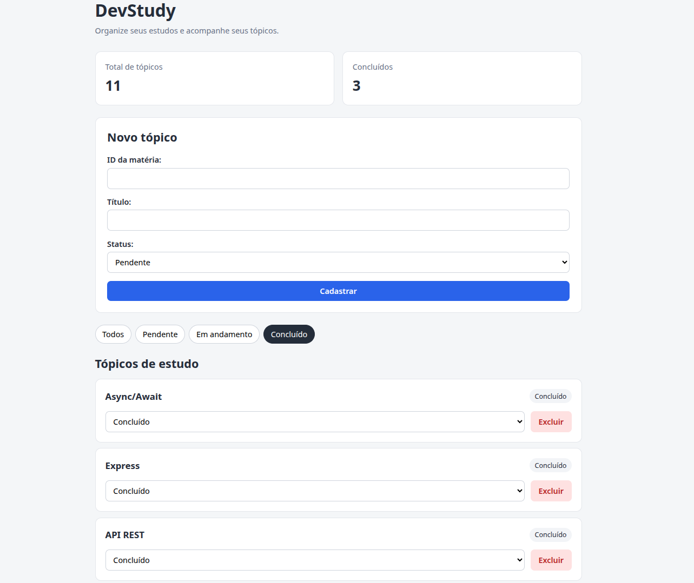
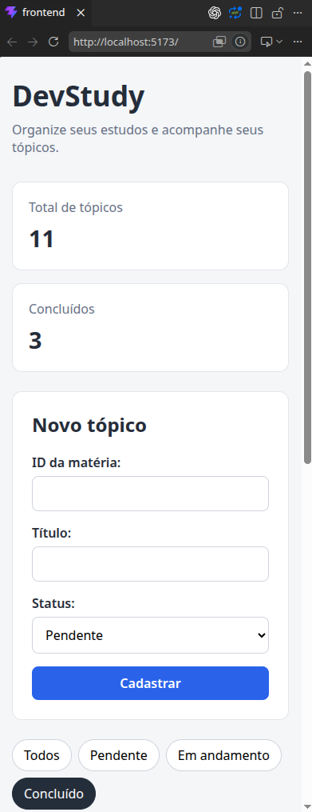

# DevStudy 📚

Aplicação full stack para organização e acompanhamento de tópicos de estudo.

> O DevStudy nasceu como um projeto prático para consolidar fundamentos de desenvolvimento full stack, acompanhando todo o fluxo de uma aplicação: React no frontend, API REST com Node.js/Express e persistência em PostgreSQL.


O projeto foi desenvolvido com o objetivo de praticar a construção de uma aplicação completa, integrando frontend, API REST e banco de dados relacional.

## ✨ Funcionalidades

- Cadastro de tópicos de estudo
- Listagem de tópicos
- Atualização de status
- Exclusão de tópicos
- Filtro por status
- Resumo de tópicos cadastrados e concluídos
- Estados de carregamento, erro e lista vazia
- Interface responsiva

## 🛠️ Tecnologias

### Frontend

- JavaScript
- React
- Vite
- CSS

### Backend

- Node.js
- Express
- API REST

### Banco de dados

- PostgreSQL

### Versionamento

- Git
- GitHub

## 🧩 Arquitetura

O frontend React consome a API REST desenvolvida com Node.js e Express.  
A API é responsável pelas regras da aplicação e pelo acesso ao PostgreSQL.

```text
Usuário
   ↓
React
   ↓
HTTP / Fetch API
   ↓
Express
   ↓
Services
   ↓
PostgreSQL
```

## 🔌 API

Principais operações disponíveis:

| Método | Endpoint | Descrição |
| --- | --- | --- |
| GET | `/topicos` | Lista os tópicos |
| GET | `/topicos/:id` | Busca um tópico |
| POST | `/topicos` | Cria um tópico |
| PATCH | `/topicos/:id` | Atualiza um tópico |
| DELETE | `/topicos/:id` | Exclui um tópico |

## 🧠 Conceitos praticados

Durante o desenvolvimento foram aplicados conceitos como:

- Componentização com React
- Props
- Estado com `useState`
- Efeitos com `useEffect`
- Renderização condicional
- Formulários controlados
- Elevação de estado
- `map()` e `filter()`
- Requisições assíncronas com `fetch`
- `async/await`
- Tratamento de erros
- API REST
- CRUD
- Persistência com PostgreSQL
- Organização do backend em camadas
- SQL
- Git e versionamento

## 🖥️ Interface





## 🚀 Executando o projeto

### Pré-requisitos

- Node.js
- npm
- PostgreSQL

### Backend

Na raiz do projeto:

```bash
npm install
```

Configure as variáveis de ambiente utilizando o `.env.example`.

Depois execute:

```bash
npm run dev
```

O backend será iniciado conforme a porta configurada nas variáveis de ambiente.

### Frontend

Em outro terminal:

```bash
cd frontend
npm install
npm run dev
```

O Vite informará no terminal o endereço utilizado pelo frontend.

## 🎯 Objetivo do projeto

O DevStudy foi desenvolvido como projeto de estudo e portfólio para consolidar conhecimentos de desenvolvimento full stack utilizando JavaScript, React, Node.js, Express e PostgreSQL.

A proposta foi construir uma aplicação pequena e compreensível, acompanhando todo o fluxo entre interface, API e persistência de dados.

## 🔭 Próximas evoluções

Possíveis evoluções futuras:

- Edição completa dos tópicos
- Gerenciamento de matérias
- Testes automatizados
- Docker
- Autenticação
- Deploy da aplicação
